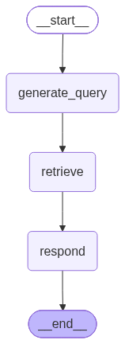
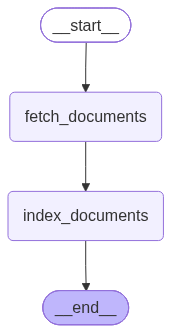

# 基于 LangGraph 的检索聊天机器人

一个基于 **LangGraph** 构建的检索增强生成（RAG, Retrieval-Augmented Generation）聊天机器人，支持**多轮对话**与**持久化记忆**。

## 特性

- 📚 **知识库构建**：读取本地 `txt` / `pdf` 文档，切分后存入 Chroma 向量数据库
- 🔍 **向量检索**：基于语义相似度召回最相关的文档片段
- 🤖 **智能生成**：结合检索结果，由大模型生成自然回答
- 💬 **多轮对话**：支持指代消解
- 💾 **持久化记忆**：通过 PostgreSQL 保存对话状态（checkpoint），跨进程不丢记忆
- 🧱 **图式编排**：用 LangGraph 的 `StateGraph` 编排「查询改写 → 检索 → 生成」流水线

## 项目结构

```
基于LangGraph的检索聊天机器人/
├── config/                  # 配置文件
│   ├── model.yml            # 模型配置（chat_model / embedding_model）
│   └── chroma.yml           # 向量库与切分配置
├── data/                    # 知识库文档（txt / pdf）
├── Graph/
│   ├── index_graph.py       # 知识库构建图（读取 → 入库）
│   └── graph.py             # 检索问答图（改写 → 检索 → 生成）
├── model/
│   └── factory.py           # 模型工厂（chat_model / embed_model）
├── prompt/
│   ├── query_prompt.py      # 查询改写提示词
│   └── react_prompt_template.py  # 回答生成提示词模板
├── rag/
│   ├── vector_store.py      # Chroma 向量库封装
│   └── rag_service.py       # 检索 + 生成服务
├── utils/
│   ├── file_handler.py      # 文件读取 / md5 计算
│   ├── config_handler.py    # 配置加载
│   └── path_tool.py         # 路径工具
├── graph.png                # 检索问答图（可视化）
├── index_graph.png          # 知识库构建图（可视化）
└── .env                     # 密钥配置
```

## 架构流程

### 检索问答图（`Graph/graph.py`）



```
用户问题 → generate_query（查询改写）→ retrieve（向量检索）→ respond（生成回答）
```

1. **generate_query**：根据对话历史，把用户问题改写为适合检索的查询（单轮直接取原话，多轮用大模型总结，结构化输出）
2. **retrieve**：用查询从 Chroma 检索 top-k 相关文档
3. **respond**：把「检索文档 + 查询」交给大模型，生成最终回答

### 知识库构建图（`Graph/index_graph.py`）



```
data 目录 → fetch_documents（读取文件）→ index_documents（切分 + 入库）
```

## 快速开始

### 1. 环境准备

- Python 3.10+
- PostgreSQL（用于持久化对话记忆）

### 2. 安装依赖

```bash
pip install -r requirements.txt
```

### 3. 配置密钥

复制 `.env` 并填入你的 API Key（`.env` 默认已存在，直接编辑即可）：

```bash
DEEPSEEK_API_KEY=你的DeepSeek密钥
DEEPSEEK_BASE_URL=https://api.deepseek.com

ZHIPUAI_API_KEY=你的智谱密钥
ZHIPUAI_BASE_URL=https://open.bigmodel.cn/api/paas/v4
```

> 项目使用 **DeepSeek** 作为聊天模型、**智谱（ZhipuAI）** 作为向量模型。可在 `config/model.yml` 中修改模型名。

### 4. 准备知识库文档

在 `data/` 目录下放入你的 `txt` 或 `pdf` 文档。

### 5. 构建向量库

```bash
python -m Graph.index_graph
```

看到「已成功加载进向量数据库！」即成功。

### 6. 启动问答

先创建 PostgreSQL 数据库（用于记忆持久化）：

```bash
psql -U postgres -c "CREATE DATABASE rag;"
```

然后运行：

```bash
python -m Graph.graph
```

## 配置说明

### `config/chroma.yml`

| 参数                             | 说明          |
| ------------------------------ | ----------- |
| `collection_name`              | Chroma 集合名  |
| `persist_directory`            | 向量库本地持久化目录  |
| `k`                            | 检索返回的文档数    |
| `chunk_size` / `chunk_overlap` | 文档切分大小 / 重叠 |
| `allow_knowledge_file_type`    | 允许入库的文件类型   |

### `config/model.yml`

```yaml
chat_model: "deepseek-v4-pro"
embedding_model: "embedding-2"
```

## 持久化记忆说明

项目使用 `PostgresSaver` 将对话状态持久化到 PostgreSQL：

- 连接串在 `Graph/graph.py` 的 `DB_URL` 中配置

- `thread_id` 用于区分不同会话（多用户场景下，每个用户一个 `thread_id` 实现隔离）

- 对话历史保存在 `checkpoints` / `checkpoint_blobs` / `checkpoint_writes` 三张表中

- **LangGraph** — 图式编排对话流程

- **LangChain** — 链式构建与文档处理

- **Chroma** — 向量数据库

- **DeepSeek** — 聊天大模型

- **智谱 AI** — 向量嵌入模型

- **PostgreSQL** — checkpoint 持久化

## 致谢

本项目参考了 [langchain-ai/retrieval-agent-template](https://github.com/langchain-ai/retrieval-agent-template) 的架构设计。
